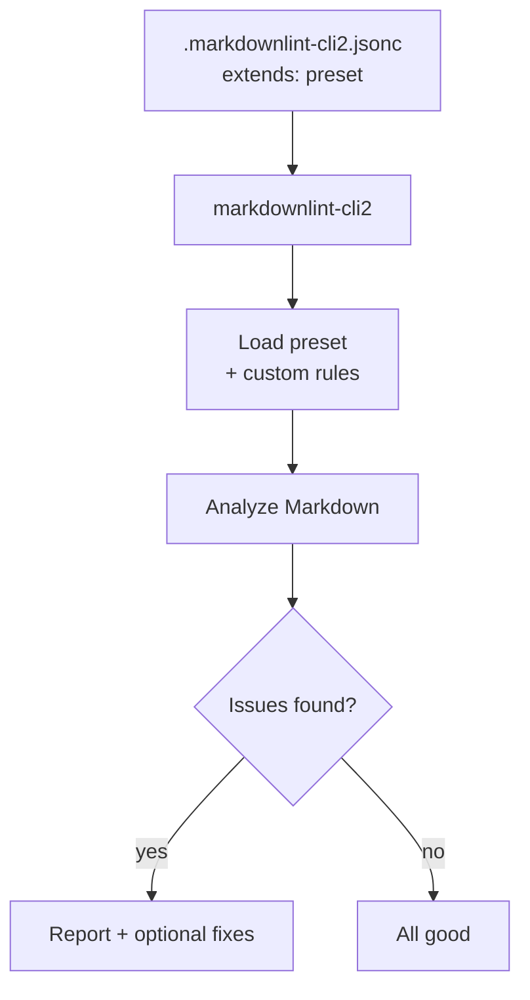

# Beginner's Guide

A quick, friendly path to use markdownlint-trap in your repo.

## 1) Install and configure

```bash
npm i -D github:kynoptic/markdownlint-trap#v1.5.0 markdownlint-cli2
```

Create `.markdownlint-cli2.jsonc`:

```jsonc
{
  "config": { "extends": "markdownlint-trap/basic-config.jsonc" }
}
```

## 2) Run the linter

```bash
npx markdownlint-cli2 "**/*.md"
# Auto-fix where supported
npx markdownlint-cli2 --fix "**/*.md"
```

## 3) Common tweaks (optional)

- Disable a rule from the preset:

```jsonc
{
  "config": {
    "extends": "markdownlint-trap/basic-config.jsonc",
    "no-literal-ampersand": false
  }
}
```

- Add special terms (proper nouns) for headings:

```jsonc
{
  "config": {
    "extends": "markdownlint-trap/basic-config.jsonc",
    "sentence-case-heading": {
      "specialTerms": ["GitHub", "JavaScript", "TypeScript"]
    }
  }
}
```

## Visual: How linting works



## Tips

- Start with the Basic preset; move to Recommended/Strict as needed.
- Run `--fix` locally; keep CI non-fixing for clarity.
- Scope globs if your repo is large (e.g., `docs/**/*.md`).

