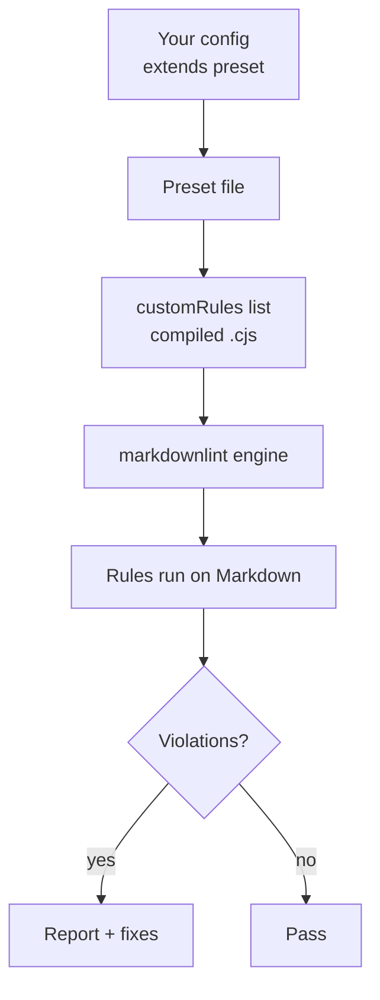

# Configuration

Getting started (most users)

```jsonc
{
  "config": { "extends": "markdownlint-trap/basic-config.jsonc" }
}
```

Presets

- Basic: `markdownlint-trap/basic-config.jsonc` — minimal, high-signal rules
- Recommended: `markdownlint-trap/recommended-config.jsonc` — balanced defaults
- Strict: `markdownlint-trap/strict-config.jsonc` — maximal style + link hygiene

Example

```jsonc
{
  "config": { "extends": "markdownlint-trap/recommended-config.jsonc" }
}
```

Visual: Configuration flow



---

## `sentence-case-heading` (SC001)

- specialTerms: string[] — Proper nouns and technical terms to preserve as-is.
- Deprecated: technicalTerms, properNouns — Use `specialTerms` instead.

Defaults: Uses built‑in dictionary of proper nouns and tech terms (no config needed for most teams). Fixable: Yes.

---

## `backtick-code-elements` (BCE001)

- ignoredTerms: string[] — Additional terms to ignore (in addition to built-in ignores).
- skipCodeBlocks: boolean (default: true) — Skip fenced/indented code blocks.
- skipMathBlocks: boolean (default: true) — Skip LaTeX `$$` math blocks.

Fixable: Yes.

---

## `no-bare-url` (BU001)

- allowedDomains: string[] — Domains allowed as bare URLs (skip reporting).
- skipCodeBlocks: boolean (default: true) — Validated; currently no special handling needed.

Fixable: Yes (wrap in `<...>`). Requires markdown-it with `linkify: true`.

---

## `no-dead-internal-links` (DL001)

- ignoredPaths: string[] — Paths to ignore when checking targets.
- checkAnchors: boolean (default: true) — Validate `#anchors` against headings.
- allowedExtensions: string[] (default: [".md", ".markdown"]) — Extensions to try for extensionless links.

Fixable: No.

---

## `no-literal-ampersand` (NLA001)

- exceptions: string[] — Phrases where `&` is allowed (e.g., `R&D`). A default list is included: `R&D`, `Q&A`, `M&A`, `S&P`, `AT&T`.
- skipCodeBlocks: boolean (default: true) — Skip fenced/indented code blocks.
- skipInlineCode: boolean (default: true) — Skip inline code spans.

Fixable: Yes (replace `&` with `and`).

---

## Migration notes

The following options are deprecated; use the replacements instead:

| Rule | Deprecated | Replacement |
|------|------------|-------------|
| `sentence-case-heading` | `technicalTerms`, `properNouns` | `specialTerms` |
