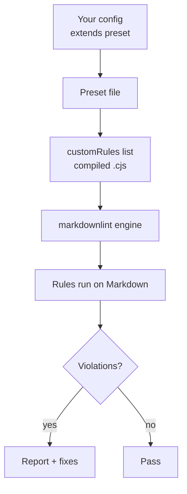

# Configuration

Getting started (most users)

```jsonc
{
  "config": { "extends": "markdownlint-trap/basic-config.jsonc" }
}
```

Presets

All three presets share a common set of standard markdownlint opinions:

| Rule | Setting | Rationale |
|------|---------|-----------|
| `MD004` | `dash` | Consistent unordered list marker |
| `MD013` | `false` | Line length is universally noisy |
| `MD029` | `one` | All-ones numbering is easy to reorder |

The presets differ in which custom rules are enabled and how many standard rules are relaxed:

| | Basic | Recommended | Strict |
|---|---|---|---|
| Custom rules | 2 (sentence-case, backticks) | All 5 | All 5 |
| `MD041` first-line-h1 | off | off | **on** |
| `MD024` duplicate heading | on | off | on |
| `MD036` emphasis as heading | on | off | on |

- **Basic** (`basic-config.jsonc`) — gentle onboarding with only high-signal custom rules
- **Recommended** (`recommended-config.jsonc`) — all custom rules with pragmatic relaxations for real-world docs
- **Strict** (`strict-config.jsonc`) — all custom rules, only `MD013` relaxed from the standard set

Example

```jsonc
{
  "config": { "extends": "markdownlint-trap/recommended-config.jsonc" }
}
```

Templates

Copy-paste starters live in `templates/` for environments that don't support `extends`:

- `markdownlint-cli2-*.jsonc` — for CLI usage (CI pipelines, pre-commit hooks)
- `vscode-settings-*.jsonc` — for the VS Code markdownlint extension (different config shape)

Templates mirror the root configs for their tier. Use `extends` when possible; use templates when your tooling requires a standalone config file.

Visual: Configuration flow



---

## `sentence-case-heading` (SC001)

- `specialTerms`: string[] — Proper nouns and technical terms to preserve as-is.
- Deprecated: `technicalTerms`, `properNouns` — Use `specialTerms` instead.

Defaults: Uses built‑in dictionary of proper nouns and tech terms (no config needed for most teams). Fixable: Yes.

---

## `backtick-code-elements` (BCE001)

- `ignoredTerms`: string[] — Additional terms to ignore (in addition to built-in ignores).
- `skipCodeBlocks`: boolean (default: true) — Skip fenced/indented code blocks.
- `skipMathBlocks`: boolean (default: true) — Skip LaTeX `$$` math blocks.

Fixable: Yes.

---

## `no-bare-url` (BU001)

- `allowedDomains`: string[] — Domains allowed as bare URLs (skip reporting).
- `skipCodeBlocks`: boolean (default: true) — Validated; currently no special handling needed.

Fixable: Yes (wrap in `<...>`). Requires markdown-it with `linkify: true`.

---

## `no-dead-internal-links` (DL001)

- `ignoredPaths`: string[] — Paths to ignore when checking targets.
- `checkAnchors`: boolean (default: true) — Validate `#anchors` against headings.
- `allowedExtensions`: string[] (default: ["`.md`", "`.markdown`"]) — Extensions to try for extensionless links.

Fixable: No.

---

## `no-literal-ampersand` (NLA001)

- exceptions: string[] — Phrases where `&` is allowed (e.g., `R&D`). A default list is included: `R&D`, `Q&A`, `M&A`, `S&P`, `AT&T`.
- `skipCodeBlocks`: boolean (default: true) — Skip fenced/indented code blocks.
- `skipInlineCode`: boolean (default: true) — Skip inline code spans.

Fixable: Yes (replace `&` with `and`).

---

## Migration notes

The following options are deprecated; use the replacements instead:

| Rule | Deprecated | Replacement |
|------|------------|-------------|
| `sentence-case-heading` | `technicalTerms`, `properNouns` | `specialTerms` |
