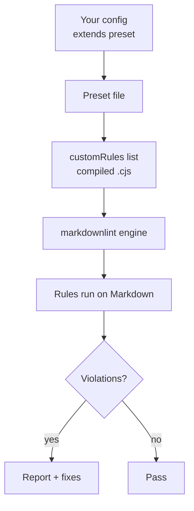

# Configuration and presets

Getting started (most users)

```jsonc
{
  "config": { "extends": "markdownlint-trap/basic-config.jsonc" }
}
```

Presets

All three presets share a common set of standard markdownlint opinions:

| Rule | Setting | Rationale |
|------|---------|-----------|
| `MD004` | `dash` | Consistent unordered list marker |
| `MD013` | `false` | Line length is universally noisy |
| `MD029` | `one` | All-ones numbering is easy to reorder |

Presets differ in custom rule coverage and standard rule relaxations:

| | Basic | Recommended | Strict |
|---|---|---|---|
| Custom rules | 2 (sentence-case, backticks) | All 5 | All 5 |
| `MD041` first-line-h1 | off | off | **on** |
| `MD024` duplicate heading | on | off | on |
| `MD036` emphasis as heading | on | off | on |

- **Basic** (`basic-config.jsonc`) — high-signal custom rules only
- **Recommended** (`recommended-config.jsonc`) — all custom rules, pragmatic relaxations for real-world docs
- **Strict** (`strict-config.jsonc`) — all custom rules, only `MD013` relaxed

Example

```jsonc
{
  "config": { "extends": "markdownlint-trap/recommended-config.jsonc" }
}
```

Templates

Copy-paste starters in `templates/` for environments that lack `extends` support:

- `markdownlint-cli2-*.jsonc` — for CLI usage (CI pipelines, pre-commit hooks)
- `vscode-settings-*.jsonc` — for the VS Code markdownlint extension (different config shape)

Templates mirror the root configs for each tier. Prefer `extends`; use templates when your tooling requires a standalone config file.

Visual: Configuration flow



---

## `sentence-case-heading` (SC001)

- `specialTerms`: string[] — Proper nouns and technical terms to preserve as-is.
- Deprecated: `technicalTerms`, `properNouns` — Use `specialTerms` instead.

Defaults: Built-in dictionary of proper nouns and tech terms covers most teams. Fixable: Yes.

---

## `backtick-code-elements` (BCE001)

- `ignoredTerms`: string[] — Terms to ignore beyond the built-in list.
- `skipCodeBlocks`: boolean (default: true) — Skip fenced/indented code blocks.
- `skipMathBlocks`: boolean (default: true) — Skip LaTeX `$$` math blocks.

Fixable: Yes.

---

## `no-bare-url` (BU001)

- `allowedDomains`: string[] — Domains exempt from bare URL reporting.
- `skipCodeBlocks`: boolean (default: true) — Skip fenced/indented code blocks.

Fixable: Yes (wrap in `<...>`). Requires markdown-it with `linkify: true`.

---

## `no-dead-internal-links` (DL001)

- `ignoredPaths`: string[] — Paths to exclude from link target checks.
- `checkAnchors`: boolean (default: true) — Validate `#anchors` against headings.
- `allowedExtensions`: string[] (default: ["`.md`", "`.markdown`"]) — Extensions to append when resolving extensionless links.

Fixable: No.

---

## `no-literal-ampersand` (NLA001)

- exceptions: string[] — Phrases where `&` is allowed (e.g., `R&D`). Defaults: `R&D`, `Q&A`, `M&A`, `S&P`, `AT&T`.
- `skipCodeBlocks`: boolean (default: true) — Skip fenced/indented code blocks.
- `skipInlineCode`: boolean (default: true) — Skip inline code spans.

Fixable: Yes (replace `&` with `and`).

---

## Autofix safety tuning

markdownlint-trap uses a three-tier confidence system to determine autofix safety.

| Tier | Default threshold | Behavior |
|------|-------------------|----------|
| Auto-fix | >= 0.7 | Applied automatically with `--fix` |
| Needs review | 0.3 -- 0.7 | Flagged for manual review, not applied |
| Skip | < 0.3 | Too uncertain, not surfaced |

### Adjust confidence thresholds

```jsonc
{
  "config": {
    "extends": "markdownlint-trap/recommended-config.jsonc",
    "sentence-case-heading": {
      "autofixSafety": {
        "confidenceThreshold": 0.8,
        "reviewThreshold": 0.4
      }
    }
  }
}
```

### Safe and unsafe words

`safeWords` boosts confidence; `unsafeWords` penalizes:

```jsonc
{
  "config": {
    "backtick-code-elements": {
      "autofixSafety": {
        "safeWords": ["webpack", "babel", "eslint"],
        "unsafeWords": ["spring", "rust", "swift"]
      }
    }
  }
}
```

### Force review or skip specific terms

- `alwaysReview`: force matching terms into the needs-review tier regardless of confidence
- `neverFlag`: suppress matching terms entirely (skip tier)

### Disable safety checks entirely

```jsonc
{
  "config": {
    "sentence-case-heading": {
      "autofixSafety": { "enabled": false }
    }
  }
}
```

## Override individual rules

Extend a preset and override specific rules:

```jsonc
{
  "config": {
    "extends": "markdownlint-trap/recommended-config.jsonc",
    "sentence-case-heading": {
      "specialTerms": ["GraphQL", "OAuth", "SSO"]
    },
    "no-literal-ampersand": false,
    "MD024": true,
    "no-dead-internal-links": {
      "ignoredPaths": ["vendor", "third_party"]
    }
  }
}
```

> [!WARNING]
> Your overrides must be in the same `config` block as `extends`. A second `config` key silently replaces the first.

### Debug autofix decisions

```bash
DEBUG=markdownlint-trap* npx markdownlint-cli2 --fix "**/*.md"
```

## Migration notes

Deprecated options and their replacements:

| Rule | Deprecated | Replacement |
|------|------------|-------------|
| `sentence-case-heading` | `technicalTerms`, `properNouns` | `specialTerms` |
