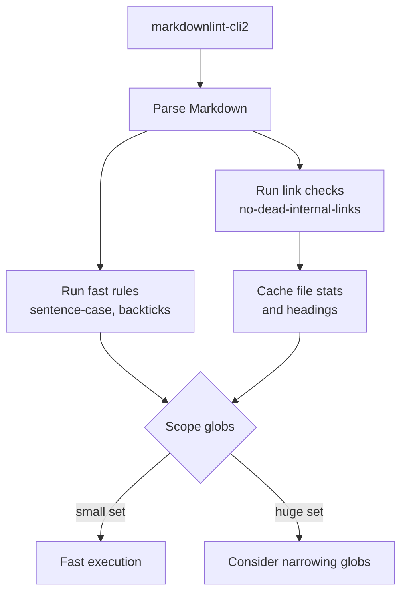

# Performance

Guidance for running markdownlint-trap efficiently in large repositories.



## Rule characteristics

- `no-dead-internal-links` performs filesystem checks and heading extraction:
  - Caches file existence, content, and extracted headings per run.
  - Scales with number of unique links per file set.
- `backtick-code-elements` and `sentence-case-heading` operate in-memory with heuristics to reduce false positives.

## Recommendations

- Scope `globs` to documentation folders when possible (e.g., `docs/**`, `guides/**`).
- Exclude generated paths: `!node_modules/**/*`, `!dist/**/*`, `!build/**/*`.
- Run with `--fix` locally to minimize CI churn; keep CI non-fixing.

## Debugging

Enable internal debug output while developing:

```bash
DEBUG=markdownlint-trap* npx markdownlint-cli2 "**/*.md"
```
