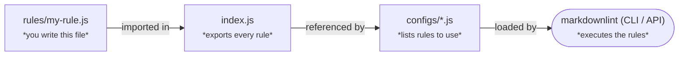
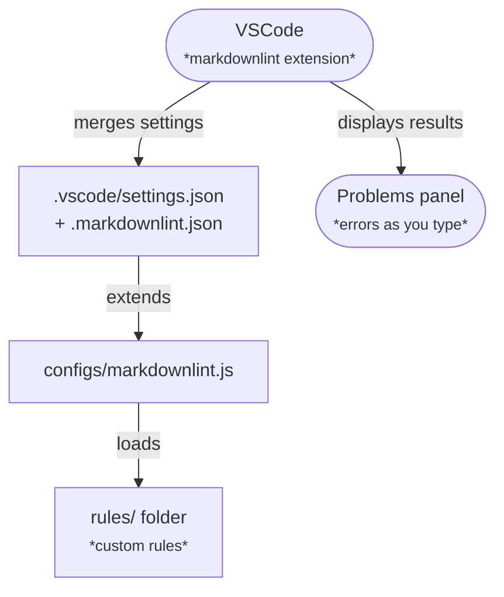
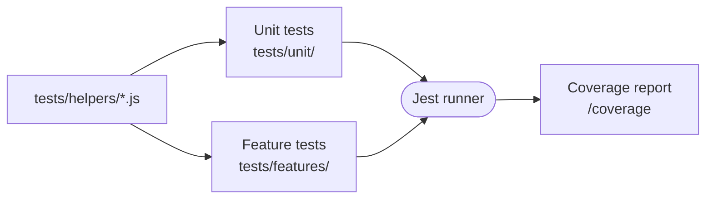

# Interactions

This document explains clearly how the `markdownlint-rules` project is structured and how you can use it—even if you're totally new to markdownlint or coding.

## What `markdownlint-rules` is

`markdownlint-rules` is a set of custom rules used to check Markdown files for errors or style issues. Markdown is a simple text format for writing structured documents (like READMEs).

## Add and use rules

### Add rules

To create a new rule:

1. **Write your rule** – Make a new JavaScript file inside the `rules/` folder, for example, `rules/my-rule.js`.
2. **Export the rule** – Edit `index.js` and include your new rule there.
3. **Update config files** – Add your new rule to the config files in the `configs/` directory.
4. **Test your rule** – Write tests to ensure your rule works correctly (explained below).



### Use rules

Once rules are added, they can be used in different ways:

* **From command line (CLI)**:

  ```bash
  markdownlint --config configs/markdownlint.js my-file.md
  ```

* **From JavaScript code (Node.js)**:

  ```js
  const markdownlint = require('markdownlint');
  const options = {
    files: ['my-file.md'],
    config: require('./configs/markdownlint.js'),
  };

  markdownlint(options, (err, result) => {
    console.log(result.toString());
  });
  ```

  ```mermaid
  flowchart LR

    subgraph "Command line"
      CLI(["Terminal command<br/>markdownlint …"])
    end
    subgraph "Programmatic"
      Node(["Node.js script<br/>require('markdownlint')"])
    end

    ConfigFile["configs/markdownlint.js"]
    Rules["rules/ folder<br/><small>*custom rules*</small>"]

    CLI  -->|"reads"| ConfigFile
    Node -->|"reads"| ConfigFile
    ConfigFile -->|"loads"| Rules
  ```

* **From VSCode** – VSCode automatically checks Markdown files as you type. It reads settings from `.vscode/settings.json` and `.markdownlint.json`. Errors or issues appear immediately in your editor.



## Test rules

Testing ensures your rules behave as expected:

* **Unit tests** – Check individual parts of rules (`tests/unit/`).
* **Feature tests** – Check rules in realistic scenarios (`tests/features/`).

Tests run automatically using Jest (a test framework).

Run tests:

```bash
npm test
```

If tests fail, you'll get clear feedback to help you fix the issues.



## Development workflow

Here's the typical workflow for contributing to this project:

1. **Write your rule or tests**.
2. **Check your code** with ESLint for style issues:

   ```bash
   npm run lint
   ```

3. **Run tests** to ensure everything works:

   ```bash
   npm test
   ```

4. **Update documentation** if you've changed how something works.
5. **Commit your changes** clearly and push to GitHub.
