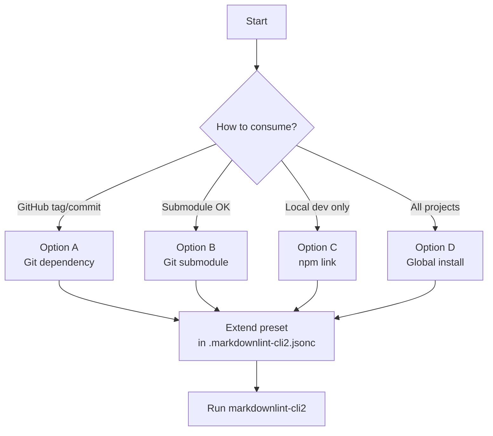

# Setup and installation

Apply `markdownlint-trap` rules in another repo using `markdownlint-cli2`.

## Quick start

```bash
npm install -D github:kynoptic/markdownlint-trap markdownlint-cli2
npx markdownlint-trap init --preset recommended --all
```

This configures the CLI, VS Code integration, CI workflow, npm scripts, and pre-commit hooks.

```bash
npm run lint:md          # check for issues
npm run lint:md:fix      # auto-fix issues
```

For a lighter setup without CI or hooks, omit `--all`:

```bash
npx markdownlint-trap init --preset recommended
npx markdownlint-cli2 "**/*.md"
```

### Common tweaks

Disable a rule:

```jsonc
{
  "config": {
    "extends": "markdownlint-trap/basic-config.jsonc",
    "no-literal-ampersand": false
  }
}
```

Add special terms for headings:

```jsonc
{
  "config": {
    "extends": "markdownlint-trap/basic-config.jsonc",
    "sentence-case-heading": {
      "specialTerms": ["GitHub", "JavaScript", "TypeScript"]
    }
  }
}
```

### Tips

- Start with the Basic preset. Move to Recommended or Strict when your team is ready.
- Run `--fix` locally. Keep CI non-fixing so violations stay visible in reviews.
- Scope globs for large repos (e.g., `docs/**/*.md`).

## Consumption methods



### Option A: GitHub dependency (recommended)

- Install: `npm i -D github:kynoptic/markdownlint-trap#v1.5.0 markdownlint-cli2`
  - Or pin a commit: `npm i -D github:kynoptic/markdownlint-trap#<commit-sha> markdownlint-cli2`
- Configure `.markdownlint-cli2.jsonc`:

  ```jsonc
  {
    "config": { "extends": "markdownlint-trap/basic-config.jsonc" },
    "globs": ["**/*.md", "!node_modules/**/*", "!dist/**/*"]
  }
  ```

- Run: `npx markdownlint-cli2 "**/*.md"` (add `--fix` to auto-fix)
- Note: Git installs run `prepare`, which builds compiled rules. If lifecycle scripts are disabled, use a tag that includes compiled files or use Option B.

### Option B: Git submodule (no lifecycle scripts needed)

- Add: `git submodule add https://github.com/kynoptic/markdownlint-trap tools/markdownlint-trap`
- Configure `.markdownlint-cli2.jsonc`:

  ```jsonc
  {
    "customRules": ["./tools/markdownlint-trap/.markdownlint-rules"],
    "config": { "extends": "./tools/markdownlint-trap/basic-config.jsonc" },
    "globs": ["**/*.md", "!node_modules/**/*", "!dist/**/*"]
  }
  ```

- Run: `npx markdownlint-cli2 "**/*.md"`
- Update later: `git submodule update --remote --merge tools/markdownlint-trap`

### Option C: npm link (local development)

- From this repo: `npm link`
- In target repo: `npm link markdownlint-trap`
- Configure like Option A and run the linter. To unlink: `npm unlink markdownlint-trap --no-save`

### Option D: Global installation (works everywhere)

Works in all projects, including non-Node.js projects.

```bash
# Automated via distribution script
npm run dist:local

# Or manual installation
npm run install:global
```

**Benefits:**

- Works in any directory without `package.json`
- VS Code extension works automatically
- Single source of truth for rules

**Usage:**

```bash
cd ~/any-project
markdownlint-cli2 "**/*.md"
```

## Distribution system

The distribution system sets up all your projects with a single command.

### Configuration

Edit `.github/distribution.local.yml`:

```yaml
# Global installation (recommended)
globalInstall:
  enabled: true
  linkLocal: true  # Use npm link for local development

# VS Code settings distribution
targets:
  - name: vscode-recommended
    enabled: true
    src: templates/vscode-settings-recommended.jsonc
    dest:
      - ~/Projects/*/.vscode/settings.json

  - name: cli-recommended
    enabled: true
    src: templates/markdownlint-cli2-recommended.jsonc
    dest:
      - ~/Projects/*/.markdownlint-cli2.jsonc
```

### Available presets

- **Basic** - Minimal enforcement; good for getting started
- **Recommended** - Balanced defaults; fits most projects
- **Strict** - Maximum enforcement; targets high-quality documentation

### Commands

```bash
npm run dist:local:dry      # Preview changes
npm run dist:local          # Apply distribution

npm run link:projects:dry   # Preview project linking
npm run link:projects       # Link to all Node.js projects

npm run unlink:projects     # Unlink from all projects
```

## Package manager support

The distribution and linking scripts detect your package manager automatically:

| Lock file | Package manager | Command used |
|-----------|----------------|--------------|
| `pnpm-lock.yaml` | pnpm | `pnpm link <path>` |
| `yarn.lock` | yarn | `yarn link` |
| `bun.lockb` | bun | `bun link` |
| (default) | npm | `npm link` |

## VS Code integration

After distribution, VS Code:

- Loads custom rules from `markdownlint-trap`
- Uses the configured preset (`basic/recommended/strict`)
- Shows inline diagnostics and suggestions
- Offers autofix on save

**Requirements:**

- [markdownlint VS Code extension](https://marketplace.visualstudio.com/items?itemName=DavidAnson.vscode-markdownlint)
- Global installation OR project-level installation of `markdownlint-trap`

## Verification and troubleshooting

### Verify installation

```bash
# Check global installation
npm list -g markdownlint-trap
which markdownlint-cli2

# Check project linking
ls -la ~/my-project/node_modules/markdownlint-trap

# Test CLI
cd ~/any-project
markdownlint-cli2 --help
```

### Cannot find `.markdownlint-rules` when extending the preset

Lifecycle scripts must run so `prepare` builds the compiled rules. Otherwise, install from a tag that includes compiled files, or use Option B (submodule).

### No violations but expected rules

Confirm `.markdownlint-cli2.jsonc` extends the preset (Option A/C) or points to the submodule paths (Option B). Test with: `npx markdownlint-cli2 README.md`.

### VS Code extension not loading rules

1. Verify `markdownlint-trap` is installed (globally or locally).
2. Check that `.vscode/settings.json` includes `markdownlint.customRules: ["markdownlint-trap"]`.
3. Reload the VS Code window: `Cmd+Shift+P` > "Reload Window".

### CLI not finding rules

1. Verify the global installation: `npm list -g markdownlint-trap`.
2. Check that `.markdownlint-cli2.jsonc` has the correct `customRules` path.
3. Reinstall: `npm run dist:local`.

### Pnpm projects failing to link

Use the distribution script, which handles pnpm with `pnpm link <path>`:

```bash
npm run link:projects
```

### Non-Node.js projects not working

Use global installation (enabled by default):

```bash
npm run dist:local
```

The rules become available everywhere without requiring `package.json`.

## Automated updates

- **Renovate**: Match `markdownlint-trap` and group updates under "markdownlint rules".
- **Dependabot**: Allow `markdownlint-trap`; GitHub installs update on new tags.

Update markdownlint-trap across all projects:

```bash
# Pull latest changes
git pull

# Rebuild and redistribute
npm run build
npm run dist:local
```

Global installations take effect immediately in all projects.

## Advanced configuration

For per-rule overrides and autofix safety tuning, see the [configuration guide](configuration.md).
