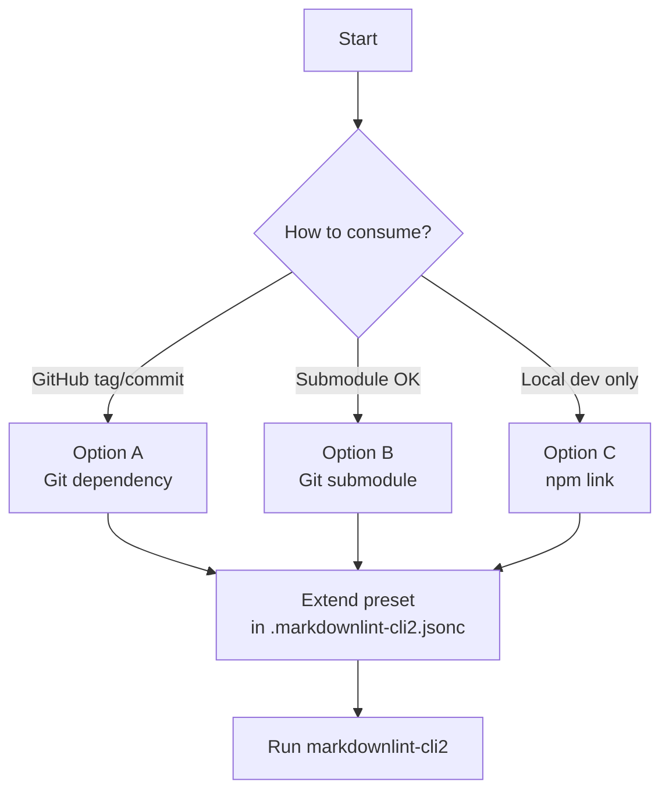

# Setup and usage

Apply `markdownlint-trap` rules in another repo using `markdownlint-cli2`.



## Use in another repo

Option A — GitHub dependency (recommended)
- Install: `npm i -D github:kynoptic/markdownlint-trap#v1.5.0 markdownlint-cli2`
  - Or pin a commit: `npm i -D github:kynoptic/markdownlint-trap#<commit-sha> markdownlint-cli2`
- Configure `.markdownlint-cli2.jsonc`:
  ```jsonc
  {
    "config": { "extends": "markdownlint-trap/basic-config.jsonc" },
    "globs": ["**/*.md", "!node_modules/**/*", "!dist/**/*"]
  }
  ```
- Run: `npx markdownlint-cli2 "**/*.md"` (add `--fix` to auto-fix)
- Note: Git installs run `prepare` and this repo builds on `prepare`, so compiled rules are available. If lifecycle scripts are disabled, use a tag that includes compiled files or Option B.

Option B — Git submodule (no lifecycle scripts needed)
- Add: `git submodule add https://github.com/kynoptic/markdownlint-trap tools/markdownlint-trap`
- Configure `.markdownlint-cli2.jsonc`:
  ```jsonc
  {
    "customRules": ["./tools/markdownlint-trap/.markdownlint-rules"],
    "config": { "extends": "./tools/markdownlint-trap/basic-config.jsonc" },
    "globs": ["**/*.md", "!node_modules/**/*", "!dist/**/*"]
  }
  ```
- Run: `npx markdownlint-cli2 "**/*.md"`
- Update later: `git submodule update --remote --merge tools/markdownlint-trap`

Option C — npm link (local development)
- From this repo: `npm link`
- In target repo: `npm link markdownlint-trap`
- Configure like Option A and run the linter. Unlink: `npm unlink markdownlint-trap --no-save`

## Automated updates (optional)
- Renovate: match `markdownlint-trap` and group under “markdownlint rules”.
- Dependabot: allow the `markdownlint-trap` dependency; GitHub installs update on new tags.

## Troubleshooting
- Cannot find `.markdownlint-rules` when extending the preset
  - Ensure lifecycle scripts run so `prepare` builds compiled rules, or install from a tag that includes them, or use Option B.
- No violations but expected rules
  - Confirm `.markdownlint-cli2.jsonc` extends the preset (Option A/C) or points to submodule paths (Option B). Try: `npx markdownlint-cli2 README.md`.
